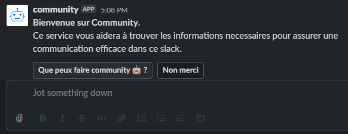

# dataagainstcovid-bot

Robot d'aide à l'action collective pour le slack [Data Against Covid-19](https://app.slack.com/client/TUQTGE7FU/)

## Utilisation

Après l'installation de l'app dans votre workspace par vos admins. Dans slack tapez: 


Community vous répond:



Puis suivez les boutons!


## Pour contribuer à ce projet

- **Ajout de commandes/boutons à l'application**

 1. Forkez le projet
 2. Ajoutez un fichier
 3. Lancez une sur la branch `develop` (on utilise gitflow ici). Votre branche devra s'appeller `feature/new-command-<nom de vos commandes>`.

Plus de detail [plus bas](#ajout-d-une-commande).

- **Pour modifier le comportement de l'application**

:warning: La plupart du flow de l'application peut etre controler depuis les fichiers JSON.

 1. Forkez le projet
 2. Modifier le fichier server.js
 3. Lancez une Pull-Request

Avant de modifier `server.js` assurez vous que ceci ne peut pas etre fait plus simplement avec des commandes.

## Configurer votre Slack App

Cette application a vocation a etre installer sur slack a travers le slack api. Elle n'est pas distribue, par slack app-store, mais vous pouvez 
l'utiliser en forkant votre copie, configurer un server sur lequel la faire tourner, relier le a travers le slack API et c'est bon!

[Guide de configuration precis a venir]

## Ajout d'une commande

Les commandes sont ecrites au format `json` dans les dossiers:

- `messages/commands_prioritaires` : Commandes principales qui apparaissent avec `/community aide`.
- `messages/commands` : Commandes a viser de l'utilisateur, mais moins importantes. Apparaissent avec `/community doc`.
- `messages/commands_hidden`: Commandes internes, avec but d'accroitre l'interactivite sans acroitre le bruit. Apparaissent avec `/community doc-dev`.

Ces fichiers sont explorés automatiquement et les commandes sont ajoutés sans autres intervention.

:warning: L'exploration des dossiers n'est pas recursive; donc ne créez pas de sous-dossiers. 

### Les commandes prioritaires

La liste des commandes prioritaire est très courte: nous voulons diriger les utilisateurs sur ces activitées.

*L'information doit y être très claire.*

:warning: N'ajoutez pas vos commandes dans le dossier `commands_prioritaires` sans l'accord préalable de l'équipe de modération dataagainstcovid19.

### Les commandes utilisateur

Ce sont le point d'entrée des actions des utilisateurs, il marque l'entrée normale d'un process utilisateur.

:warning: Reflechissez bien au point d'entrée logique pour votre chaîne d'actions.

### Les commandes internes

Ces commandes ont pour but de relier les actions des blocks interactifs entre-eux pour créer des flux d'informations digestes.

:warning: Leur nom bien que moins important doit être clair au developpeur suivant.

## Format des commandes

Les commandes sont des fichiers `JSON` qui necessitent au moins deux attributs:

- `"command"` (string; or array of strings) : répèrtorie les noms que prend la commande (utiliser pour l'appeller et produire sa doc).
- `"answer"` (JSON block object): décrit le message à envoyer. Ce message est créé à l'aide de l'interface graphique [du BlockKit builder de slack](https://api.slack.com/tools/block-kit-builder?mode=message&blocks=%5B%5D).

Ci-dessous un exemple de fichier command sans réponses.

```json
{
  "command": ["Une nouvelle commande a executer", "nouvelle-cmd"],
  "answer": {
    // go to https://api.slack.com/tools/block-kit-builder?mode=message&blocks=%5B%5D
    // To generate a valid and pretty Slack message response
    // And paste it inside the answer field
  }
}
```

Vous avez aussi la possibilité de stocker plusieurs commandes par fichiers:

```json
[
  {
    "command": ["Une nouvelle commande a executer", "nouvelle-cmd"],
    "answer": {
      // ...
    }
  },
  {
    "command": ["Une deuxieme commande a executer", "deuxieme-cmd"],
    "answer": {
      // ...
    }
  }
]
```

Ces commandes sont exactement comme si elles étaient chacune dans leur fichier.

### Les blocks

Les blocks sont le format de messageries des application slack. Ce sont des objets au format `JSON`. Prennons exemple sur les blocks du fichier `_.json` qui apparait lorsque la commande `\community` est tapée dans votre barre de message sur slack:

```json
{
  "blocks": [
    {
      "type": "section",
      "text": {
        "type": "mrkdwn",
        "text": "*Bienvenue sur Community*.\nCe service vous aidera à trouver les informations necessaires pour assurer une communication efficace dans ce slack.\n"
      }
    },
    {
      "type": "actions",
      "elements": [
        {
          "type": "button",
          "action_id": "interactif-_/aide",
          "value": "aide",
          "text": {
            "type": "plain_text",
            "text": "Que peux faire community :robot_face: ?"
          }
        },
        {
          "type": "button",
          "action_id": "interactif-_/au-revoir",
          "value": "au-revoir",
          "text": {
            "type": "plain_text",
            "text": "Non merci"
          }
        }
      ]
    }
  ]
}
```

### Ajout de texte: le block `section`

Le premier block est un block de type `"section"`. Il contient simplement du texte et supporte le format markdown.

```json
{
    "type": "section",
    "text": {
    "type": "mrkdwn",
    "text": "*Bienvenue sur Community*.\nCe service vous aidera à trouver les informations necessaires pour assurer une communication efficace dans ce slack.\n"
    }
},
```

### Rendre le bot interactif: le block `actions`

Ce block ajoute deux boutons:

- Que peux faire community :robot_face: ?
- Non merci

```json
{
    "type": "actions",
    "elements":
    [
        {
            "type": "button",
            "action_id": "interactif-_/aide",
            "value": "aide",
            "text": {
                "type": "plain_text",
                "text": "Que peux faire community :robot_face: ?"
            }
        },
        {
            "type": "button",
            "action_id": "interactif-_/au-revoir",
            "value": "au-revoir",
            "text": {
                "type": "plain_text",
                "text": "Non merci"
            }
        }
    ]
}
```

Pour que ces boutons deviennent interactifs deux attributs clefs:

- `"action_id"` : un id unique dans l'aplication se referent à ce bouton précis. Pour ce bot il doit etre nommer suivant la norme suivante: `interactif-<nom de la commande d'appel>/<nom de la commande appelée>`.
- `"value"` : La commande à envoyer lorsque le bouton est appuyé. Nous recommendons l'utilisation des alias court des commandes.

### Autres options

Il y a encore bien d'autres blocks: comme les selectionneurs, les blocks contexte, ou image; veuillez utiliser le [block kit de design](https://api.slack.com/tools/block-kit-builder?mode=message&blocks=%5B%5D) mis a disposition par slack.
